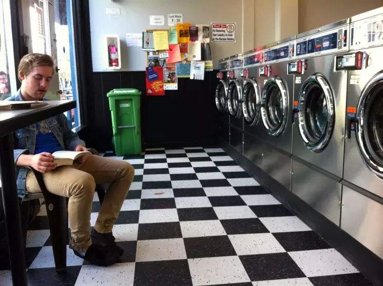

<!-- section start -->
<!-- attr: { id:'', class:'slide-title', showInPresentation:true, hasScriptWrapper:true } -->
# Multithreaded programming: Fundamentals
## Brief overview and concepts, Creating and starting threads, Threads synchronization, Locking shared resources, Thread states

<div class="signature">
	<p class="signature-course">Multithreaded programming</p>
	<p class="signature-initiative">Telerik Academy Plus</p>
	<a href="http://academy.telerik.com/seminars/software-engineering/" class="signature-link">http://academy.telerik.com/seminars</a>
</div>


<!-- section start -->
<!-- attr: { id:'', class:'slide-section', showInPresentation:true, hasScriptWrapper:true } -->
# Table of Contents
## What will we cover?


<!-- attr: { id:'', showInPresentation:true, hasScriptWrapper:true } -->
# Table of Contents - I
- [Brief overview and concepts](#overview)
- [Parallel vs Concurrent vs Async](#concurrencyVsParallelism)
- [Process vs. Thread](#processVsThread)
- [Multitasking vs. Multithreading](#multitaskingVsMultithreading)
 - [Cooperative multitasking](#cooperativeMultitasking)
 - [Preemptive multitasking](#preemptiveMultitasking)
- [Multithreading use-cases](#useCases)
- [Multithreading caveats](#caveats)


<!-- attr: { id:'', showInPresentation:true, hasScriptWrapper:true } -->
# Table of Contents - II
- [Creating and Starting threads](#creatingAndStartingThreads)
- [Parameterized Thread Start](#parameterizedThreadStart)
- [Naming threads](#namingThreads)
- [Background threads](#backgroundThreads)
 - [a.k.a Daemon threads](#daemonThreads)
- [Threads lifetime](#threadLifetime)
- [Thread priority](#threadPriority)
- [Joining a Thread](#joiningThreads)


<!-- attr: { id:'', showInPresentation:true, hasScriptWrapper:true } -->
# Table of Contents - III
- [Race condition](#raceCondition)
- [Critical sections](#synchronizingThreads)
- [Locking shared resources](#lockingSharedResources)
- [The tricky "volatile" keyword](#volatileKeyword)


<!-- attr: { id:'', showInPresentation:true, hasScriptWrapper:true } -->
# Table of Contents - IV
- [Thread States](#threadStates)
	- [Unstarted](#unstartedState)
	- [Running](#runningState)
	- [Blocked](#blockedState)
	- [Interrupted](#interruptedState)
	- [StopRequested/Stopped](#stoppedState)
	- [SuspendRequested/Suspended](#suspendedState)
	- [AbortRequested/Aborted](#abortedState)


<!-- attr: { id:'', showInPresentation:true, hasScriptWrapper:true } -->
# Quote
"In programming, **concurrency** is the composition of **independently executing processes**,  
while **parallelism** is the **simultaneous execution** of (possibly related) computations."  
 \- Andrew Gerrand -  

<br/>
 [Rob Pike: "Concurrency is not Parallelism" (Video)](https://vimeo.com/49718712)


<!-- section start -->
<!-- attr: { id:'overview', class:'slide-section', showInPresentation:true, hasScriptWrapper:true } -->
# <a id="overview"></a> Brief overview
## Understanding asynchronous,<br> parallel and concurrent work


<!-- attr: { id:'', showInPresentation:true, hasScriptWrapper:true, style: 'font-size:0.9em;' } -->
# Synchronous work
In order to understand what Asynchronous programming is, we must have a clear definition for what **Synchronous programming** is:
- **Sequential** execution of code statements.
- If a blocking operation occurs, the whole process is blocked.
- If a long-running operation occurs, the UI becomes unresponsive.
- CPU-demanding tasks delay the execution of all other tasks.
- Accessing external resources blocks the entire process (reading files from the HDD, querying a web service, etc).


<!-- attr: { id:'', showInPresentation:true, hasScriptWrapper:true, style: 'font-size:0.9em;' } -->
# Synchronous work
A real life example would be:
- A man is doing a presentation for work.
- His wife starts spamming him with random questions, just to get his attention.
- A man can't give attention, because he maxed out his CPU resources on the work he is currently doing, so he is not-responding back to his wife. He is not even listening to what she says.
- After his work is completed, he turns around with a cute smile and asks his wife - "Whatsup? :)", but he has no idea that 30 seconds ago with his silence he accidentally opened Pandora's box.


<!-- attr: { id:'', class:'slide-section', showInPresentation:true, hasScriptWrapper:true } -->
# Freezing UI
## Live demo


<!-- attr: { id:'', showInPresentation:true, hasScriptWrapper:true, style: 'font-size: 0.9em;' } -->
# Asynchronous work
- In general, asynchronous (from Greek asyn-, meaning "not with," and chronos, meaning "time") is an adjective describing objects or events that are not coordinated in time.

- In computer programs, asynchronous operation means that a process operates independently of other processes.

- A program using asynchronous programming, dispatches tasks to devices that can take care of themselves, leaving the program free to do something else until it receives a signal that the work is completed.


<!-- attr: { id:'', showInPresentation:true, hasScriptWrapper:true, style: 'font-size:0.9em;' } -->
# Asynchronous work
- **Example:** A woman sits in a cafeteria and orders a coffee. While waiting for her coffee to be served, she is reading the morning newspaper.

<!--  -->
</br>
</br>
</br>
</br>
</br>
</br>
</br>
- Not this one though, she already has a coffee.


<!-- attr: { id:'', showInPresentation:true, hasScriptWrapper:true, style: 'font-size:0.9em;' } -->
# Asynchronous work
- Example: This guys is asynchronously doing his laundry while reading Twilight.

<!--  -->
</br>
</br>
</br>
</br>
</br>
</br>
</br>
</br>
</br>
- Apparently, reading is the new black.


<!-- attr: { id:'', class:'slide-section', showInPresentation:true, hasScriptWrapper:true } -->
# Responsive UI
## Live demo


<!-- attr: { id:'', showInPresentation:true, hasScriptWrapper:true, style: 'font-size:0.9em;' } -->
# Parallel work


<!-- attr: { id:'', class:'slide-section', showInPresentation:true, hasScriptWrapper:true } -->
# <a id=""></a> Sum of all numbers in a given interval
## [Demo:]()


<!-- section start -->
<!-- attr: { id:'', class:'slide-section', showInPresentation:true, hasScriptWrapper:true } -->
# Concurrency vs. Parallelism
## Diffrences between concurrency and parallelism


<!-- attr: { id:'', showInPresentation:true, hasScriptWrapper:true } -->
# Concurrency vs Parallelism
 - Concurrency is about **dealing** with lots of things at once.
 - Parallelism is about **doing** lots of things at once
 - Not the same concepts, but **related**
 - One is about structure, one is about execution


<!-- section start -->
<!-- attr: { id:'', class:'slide-section', showInPresentation:true, hasScriptWrapper:true } -->
# Process vs. Thread


<!-- attr: { id:'', showInPresentation:true, hasScriptWrapper:true } -->
# What is a Process?
 - In terms of computing - a process is an **instance** of a **computer program** that is being **executed**.  
 - It contains the **program code** and its **current activity**.   
 - Depending on the **OS**, a process may be made up of **multiple threads of execution**, that execute instructions <a href="https://en.wikipedia.org/wiki/Concurrency_(computer_science)">_concurrently_</a>.


<!-- attr: { id:'', showInPresentation:true, hasScriptWrapper:true } -->
# What is a Process?
 - A computer program is a _**passive collection**_ of instructions, while a process is the _**actual execution**_ of those instructions.   
 - _**Several processes**_ may be associated with the _**same program**_. For example, opening up several instances of the same program (Visual Studio, Google Chrome, etc), often means more than one process is being executed.


<!-- attr: { id:'', showInPresentation:true, hasScriptWrapper:true } -->
# What is a Process?
 - Each process **provides the resources** needed to execute a program.
 - Each process is started with a **single thread of execution**, often called the **primary thread**, and can create additional threads from any of its threads.


<!-- attr: { id:'', showInPresentation:true, hasScriptWrapper:true } -->
# What is a Process?
 - A process has a:
  - **Virtual address space**
  - **Executable code**
  - **Open handles to system objects** & **security context**
  - **Unique process identifier**
  - **Environment variables** & **priority class**
  - **At least one thread of execution**.


<!-- attr: { id:'', showInPresentation:true, hasScriptWrapper:true } -->
# What is a Thread?
 - A thread is an **entity within a process** that can be **scheduled** for execution.
 - All threads of a **process** share its **virtual address space** and system resources.
 - Each thread maintains **exception handlers**, a **scheduling priority**, thread **local storage**, a unique **thread identifier**, and a **set of structures** the system will use to save the **thread context** until it is **scheduled**.


 <!-- attr: { id:'', showInPresentation:true, hasScriptWrapper:true } -->
# What is a Thread?
 - The **thread context** includes:
	 - **The thread's set of machine registers**
	 - **The kernel stack**
	 - **A thread environment block (TEB)**
	 - **A user stack in the address space of the thread's process**.
 - Threads can also have their own **security context**, which can be used for impersonating clients.


<!-- section start -->
<!-- attr: { id:'', class:'slide-section', showInPresentation:true, hasScriptWrapper:true } -->
# Multithreading vs. Multitasking


<!-- attr: { id:'', showInPresentation:true, hasScriptWrapper:true } -->
# What is Multitasking?
 - <a href="https://en.wikipedia.org/wiki/Computer_multitasking">_**Multitasking**_</a> is a concept of **performing multiple tasks** (processes) over a certain **period of time** by executing them in a **parallel** manner or **concurrently**.  
 - **New tasks start** and **interrupt already started ones** before they have reached completion, **instead of executing the tasks sequentially** so each started task needs to reach its end before a new one is started.  


<!-- attr: { id:'', showInPresentation:true, hasScriptWrapper:true } -->
# What is Multitasking?
 - The tasks share common processing resources such as central processing units **(CPUs)** and **main memory**.
 - Multitasking does not necessarily mean that multiple tasks are executing at exactly the same time. **Multitasking does not imply parallel execution**, but it does mean that more than one task can be **part-way** through execution at the same time, and that **more than one task** is **advancing** over a given period of time.


<!-- attr: { id:'', showInPresentation:true, hasScriptWrapper:true } -->
# What is Multithreading?
Multithreading **extends the idea of multitasking** into applications, so you can **subdivide specific operations** within a **single application** into individual threads. Each of the threads can run in **parallel**. **The OS divides processing time** not only **among different applications**, but also **among each thread within an application**.


<!-- attr: { id:'', showInPresentation:true, hasScriptWrapper:true } -->
# What is Multithreading?
A common example of the **advantage of multithreading** is the fact that you can have a **word processor** that **prints a document** using a background thread, but at the same time another thread is running that **accepts user input**, so that you can type up a new document.


<!-- attr: { id:'', showInPresentation:true, hasScriptWrapper:true } -->
# Summary
**Multitasking** is the **ability of an OS** to run **several tasks**(processes) at the **same time**.  

Switching between the tasks is so fast that the user can interact fully with the system, **without having to wait for one task to be completely finished** (at least he does not feel like waiting, in practice - he is waiting a couple milliseconds)


<!-- attr: { id:'', showInPresentation:true, hasScriptWrapper:true } -->
# Summary
**Multithreading** is the **ability of an OS** to execute **different parts of a program**, called threads, **concurrently**. Multithreading usually involves very sophisticated programs that use multiple CPUs at the same time to **improve performance and responsiveness**.  
A computer with multiple CPUs which does not have applications written specifically to use multiprocessing or multithreading uses just one CPU.


<!-- section start -->
<!-- attr: { id:'', class:'slide-section', showInPresentation:true, hasScriptWrapper:true } -->
# Threads lifetime
## Managed thread objects and OS threads


<!-- attr: { id:'', showInPresentation:true, hasScriptWrapper:true } -->
# Threads lifetime
- Consider the behavior of the following code:

```cs
if (true)
{
	 new Thread(() =>
	 {
		 ExecuteLongRunningTask();
	 }).Start();
}

while (true)
{
	 //do nothing
	 Thread.Sleep(100);
}
```

- Will the thread be suspended after the GC collects the "Thread" object that is no longer referenced in the execution scope?

<!-- attr: { id:'', showInPresentation:true, hasScriptWrapper:true } -->
# Threads lifetime
- `Thread` objects will be eligible for garbage collection as soon as they are no more used.
- In our example - after calling the `Start()` method, the `Thread` object will be immediately scheduled for GC. It will however not be collected immediately, as the GC runs at specific times. [Learn more about GC .](http://www.red-gate.com/products/dotnet-development/ants-memory-profiler/learning-memory-management/memory-management-fundamentals)
- However, the actual **OS thread** is not relying on the `Thread` object and will continue to run even if the `Thread` object is collected.


<!-- section start -->
<!-- attr: { id:'', class:'slide-section', showInPresentation:true, hasScriptWrapper:true } -->


<!-- attr: { showInPresentation:true, hasScriptWrapper:true } -->
# Free Trainings @ Telerik Academy
- C# Programming @ Telerik Academy
    - csharpfundamentals.telerik.com
  - Telerik Software Academy
    - academy.telerik.com
  - Telerik Academy @ Facebook
    - facebook.com/TelerikAcademy
  - Telerik Software Academy Forums
    - telerikacademy.com/Forum/Home  

<!--  -->
<!--  -->
